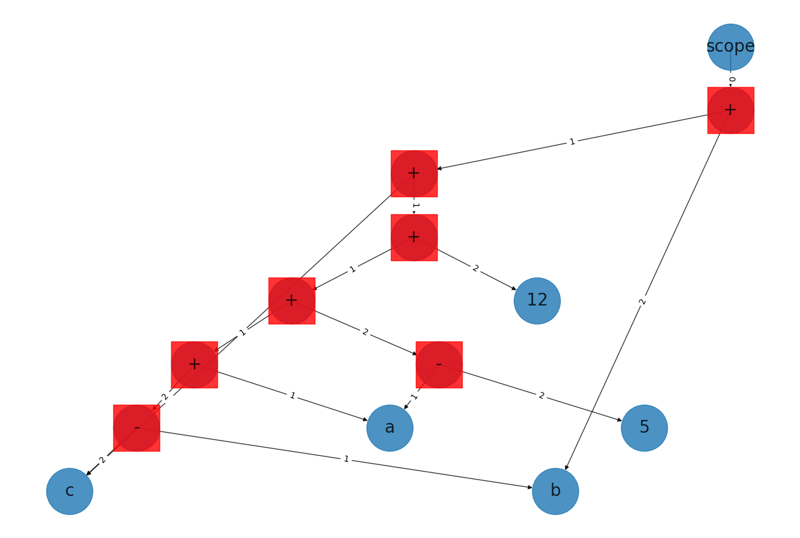
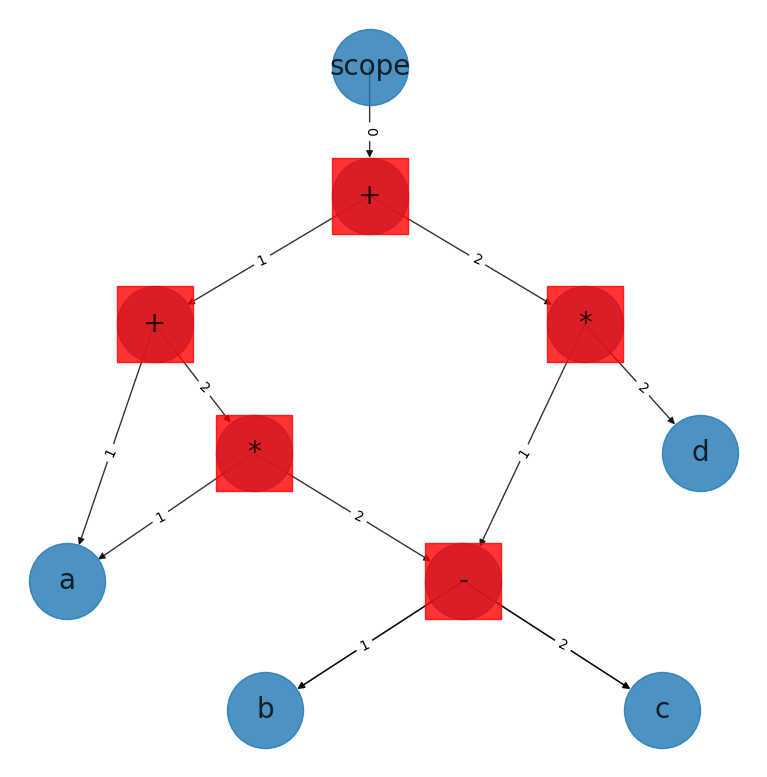

# Kompilatory

Repository contains excercises for AGH UST compilers course - http://orchel.pl/compilers.php

### Wymagania: - Python 3.7.4

### Przygotowanie środowiska:

```
    python -m venv compilers
    source compilers/bin/activate
    pip install -r requirements.txt
```

### Uruchomienie interpretera:

```
    python myparser.py
```

Przy poprawnym uruchomieniu interpretera w lewym dolnym rogu terminala pojawi się prompt:

```
    >>
```

Brawo! Udało Ci się poprawnie przygotować środowisko i uruchomić kalkulator, pora wykonać pierwszą operację:

Wpisz:

```
    >> 2100 + 37
```

I kliknij enter

Output:

```
    ('NUMBER', 2137)
```

### Uruchomienie testów lexera:

```
    python lexer_test.py
```

### Uruchomienie testów parsera:

```
    python parser_test.py
```

## 1. Opis zaimplementowanych funkcjonalności.

### Kalkulator wspiera 3 typy wartości:

- wartości numeryczne typ INT lub DOUBLE (WN)
- ciągi znaków - typ STRING (CZ)
- wartości logiczne - typ BOOL (WL)

### oraz operacje:

- dodawanie (+) (WN i CZ)
- odejmowanie (-) (WN)
- mnożenie (\*) (WN)
- dzielenie (/) (WN)
- potęgowanie (\*\*) (WN)
- funkcje trygonometryczne (sin, cos, tg, ctg) dla (WN)
- funkcja wykładnicza (exp [WN])
- relacje większości, mniejszości i równości (>, < , >= , <= , ==) (WN)
- operacje logiczne - and (&&) i or (||) ()

### Składnia alokowania zmiennej:

```
    TYP nazwa = WARTOSC
```

widoczność zmiennych jest ograniczona do bloku wywołania. Przykładowo:

```
    {
        {
            INT x = 2;
        }

        x = 1
        #Exception: Variable x has not been initialized!
    }
```

Natomiast aby usykać zakres globalny należy użyć słowa kluczowego `GLOBAL`:

```
    GLOBAL TYP nazwa = WARTOSC
```

W ten sposób powyższa operacja zostanie obsłużona.

### Składnia bloków if-else:

```
    IF (cond) {...} ELSE {...}
```

### Składnia pętli for:

```
    FOR(TYP nazwa = expr ; cond ; expr) {...}
```

### Składania definiowania funkcji:

```
    DEF TYP nazwa ( TYP1 arg1 ... ) { ... ; ... ; expr}
```

funkcje zwracają wartość z ostatniej linii (oznaczone jako expr w przykładzie), w przypadkach bardziej skoplikowanych można użyć słowa kluczowego RETURN. Przykład

```
    DEF INT michal () { IF ( True ) { RETURN 1 } ELSE {RETURN 2}}
```

Output:

```
    ('NUMBER', 1)
```

### Konwersja typów:

Wszystkie operatory w przypadku braku zgodności typów argumentów będą próbowały konwertować prawy operand do typu lewego przykładowe operacje:

```
    >> 1 + "23"
    ('NUMBER', 24.0)

    >> "dostane z kompilatorow " + 5
    ('STRING_T', 'dostane z kompilatorow 5')

    >> 1 + True
    ('NUMBER', 2)

    >> True && 1
    ('BOOL', True)
```

## 2. Dokumentacja do projektu: szczegóły implementacji.

Za proces tokenizacji inputu odpowiada klasa - `MyLexer`
Za proces budowania drzewa składniowego - `MyParser`

### Przy budowie drzewa składniowego wykorzystywane są klasy:

Wszystkie klasy implementują funkcje:

- **plot(graph)** - dodanie operacji do wizualzacji drzewa składniowego
- **eval(scope)** - obliczenie wartości operacji, wraca krotkę (TYP, WARTOŚĆ)
- **STATIC acquire(args)** - w celu optymalizacji użyca pamięci, funkcja zwraca wartości z puli
- **redux()** - redukcja operacji (np. obliczenie wartości w przypadku znania wartości obu argumentów w czasie kompilacji lub optymalizacje algebraiczne)

## Lista klas:

### - **Root** - klasa obrazująca blok komend

- **redefines_value()**
  funkcja która wzraca nazwy zmiennych, którch wartość zostanie zmieniona w tym bloku kodu
- **trim()**
  operacja usunięcia zbędnych linii kodu - tych po użyciu słowa kluczowego `RETURN`
- **eval_in_scope(scope)**
  początek wykonania programu

### - **Scope** - reprezenracja stosu zmiennych

- **push_layer()** - dołożenie ramki stosu
- **pop_layer()** - zjęcie ramki ze stosu
- **\_print()** - wypisanie na ekran wszystkich ramek stosu

### \* **UnaryOp** - operacje unarne

### \* **BinOp** - abstrakyjna klasa, która jest podstawą reprezentacji operacji binarnej

- **STATIC acquire(left, right, op_sign)** funkcja fabryczna - na podstawie znaku - `op_sign` zwraca odpowiednia implementację BinOp

* **Subtract** - klasa implementacja operację odejmowania
* **GT** - klasa implementacja relację większości
* **LT** - klasa implementacja relację mniejszości
* **GE** - klasa implementacja relację większości z domknieciem
* **LE** - klasa implementacja relacji mniejszości z domknięciem
* **IS** - klasa implementacja relac\*ji równości
* **AND** - klasa implementacja operację logiczną - and
* **OR** - klasa implementacja operację logiczną - or
* **Divide** - klasa implementacja operację dzielenia
* **Power** - klasa implementacja operację potęgowania
* **BinOpReversable** - abstrakcyjna klasa, nadpisująca operator porówania dla operacji przemiennych
  - **Addition** - klasa implementująca operację dodawania
  - **Mult** - klasa implementacja operację mnożenia

### \* **Constant** - reprezentacja stałej

### \* **ForLoop** - reprezentacja pętli for

- **hoist_code()** - wyniesienie linii kodu nie zmieniających się podczas iteracji pętli

### \* **VariableInit** - reprezentacja inicjalizacji zmiennej

### \* **GlobVariableInit** - reprezentacja inicjalizacji zmiennej globalnej

### \* **FunctionInit** - reprezentacja inicjalizacji funkcji

### \* **VariableRedef** - reprezentacja operacji przypisania do zmiennej

### \* **VariableCall** - reprezentacja odczytania wartości zmiennej

### \* **FunctionCall** - reprezentacja wywołania funkcji

- Warto dodać że typ wartości zwracanej jest sprawdzany dopiero w runtimie. W przypadku braku zgodności typów nie dojdzie do rzutowania, tylko zostnie zgłoszony wyjątek.

### \* **IfElse** - reprezentacja bloku if-else

## Ograniczenia:

- brak definiowania własnych klas

## Przykłady użycia kaluklatora:

```
>> DEF INT increment( INT x ) { x + 1 }
()
>> increment(1)
('NUMBER', 2.0)

>> "hihihih" + 1 + 1 + 1 + 1 + 1 + 1 + 2 * 9
('STRING_T', 'hihihih11111118')
```

## Weryfikacja funkcjonalności:

Projekt zawiera dwie klasy TestParser oraz TestLexer. Niżej przedstawione wymienione są konkretne test, w celu potwierdzenia faktu implementacji funkcjonalności

## Diagramy:

```
>> a + b - c + a - 5 + 12 + c + b
```



```
>> a + a ∗ (b − c) + (b − c) ∗ d
```



## 1. Funkcjonalność z laboratorium 1

1. Obsługa tokenów dla liczb całkowitych i rzeczywistych

Wykonanie: 5/5

Testy potwierdzające:

```
TestLexer
   test_float
   test_int
```

2. Obsługa tokenów dla funkcji specjalnych sin, cos, itd

Wykonanie: 5/5

Testy potwierdzające:

```
TestLexer
    test_special_fn
```

3. Obsługa tokenów dla operatora potęgowania, itd

Wykonanie: 5/5

Testy potwierdzające:

```
TestLexer
    test_power
```

4. Automatyczna koretka błędów w tokenach

Wykonanie: 5/5

Testy potwierdzające:

```
TestLexer
    test_special_fn
```

5. Definiowanie wzorów w tekście dla języka Markdown

Wykonanie: 0/5

6. Konwersja tokenów języka html do języka Markdown

Wykonanie: 0/5

7. Lexer dla wybranych fragmentów html

Wykonanie: 0/5

#### SUMA: 20/35pkt

## 2. Funkcjonalność z laboratorium 2

1.  Implementacja działań potęgowania, funkcji specjalnych, działań relacyjnych, zmiany znaku.

Wykonanie: 5/5

Testy potwierdzające:

```
TestParser
    test_binop_number
    test_special_func
    test_log
    test_rel
    test_unary_minus
```

2.  Implementacja instrukcji oddzielonych średnikiem.

Wykonanie: 5/5

Testy potwierdzające:

```
TestParser
    test_multiple_lines
```

3.  Kontynuacja parsowania kolejnych instrukcji w przypadku błędu.

Wykonanie: 5/5

Implementacja metod:

```
    def p_error(self, p):
        print(f"Syntax error: {p.value}")

    def t_error(self, t):
        print("Illegal character '%s'" % t.value[0])
        t.lexer.skip(1)
```

4.  Możliwość wykonywania obliczeń dla odwrotnej notacji polskiej.

Wykonanie: 5/5

Testy potwierdzające:

```
TestParser
    test_rpn
```

5.  Instrukcje warunkowe i pętle.

Wykonanie: 5/5

Testy potwierdzające:

```
ParserTest
    test_if_else
    test_for
```

6.  Terminowe wgranie zadań na laboratorium.

Wykonanie: 5/5

#### SUMA: 30/30pkt

## 3. Funkcjonalność z laboratorium 3

1. Wizualizacja drzewa składniowego.

Wykonanie: 5/5

Ta funkcjonalność korzysta z modułu `networkx`.
Klasy wykorzystywane przy reprezentacji drzewa składniowego implementują funkcję plot.

Przykłady prostych drzew składniowych:

2. Deklarowanie typów dla zmiennych.

Wykonanie: 5/5

Kalkulator wspiera 4 typy zmiennych:

- BOOL
- STRING
- INT
- FLOAT

Testy potwierdzające:

```
TestParser
    test_variable_init
```

3. Sprawdzanie typów.

Wykonanie: 5/5

Testy potwierdzające:

```
TestParser
    test_type_control
```

4. Instrukcja przypisania.

Wykonanie: 5/5

Testy potwierdzające:

```
TestParser
    test_variable_assign
```

5. Przeciążanie operatorów.

Wykonanie: 5/5

Testy potwierdzające:

```
TestParser
    test_overload_ops
```

6. Sprawdzanie syntaktyczne deklaracji oraz syntaktyczne instrukcji.

Wykonanie: 10/10

8. Konwersja typów za pomocą dodatkowego operatora.

Wykonanie: 5/5

W dalszym etapie, została zaimplementowana funkcjonalność automatycznej konwersji typów

<!-- Testy potwierdzające:

```

``` -->

9. Terminowe wgranie zadań na laboratorium.

Wykonanie: 5/5

#### SUMA: 30/30pkt

## 4. Funkcjonalność z laboratorium 4

1. Definiowanie funkcji.

Wykonanie: 5/5

Testy potwierdzające:

```
TestParser
    test_fn_definition
    test_nested
```

2. Definiowanie bloków instrukcji.

Wykonanie: 5/5

Testy potwierdzające:

```
TestParser
    test_global
```

3. Definiowanie zmiennych globalnych i lokalnych.

Wykonanie: 5/5

Testy potwierdzające:

```
TestParser
    test_global
```

4. Instrukcja wywołania funkcji.

Wykonanie: 5/5

Testy potwierdzające:

```
TestParser
    test_fn_definition
```

5. Automatyczna konwersja typów.

Wykonanie: 5/5

Testy potwierdzające:

```
TestParser
    test_conversion
```

6. Terminowe wgranie zadań na laboratorium.

Wykonanie: 5/5

#### SUMA: 30/30pkt

## 5. Funkcjonalność z laboratorium 5

1. Zagnieżdżone wywołania funkcji.

Wykonanie: 5/5

Testy potwierdzające:

```
TestParser
    test_nested
```

2. Pomijanie zbędnych instrukcji.

Wykonanie: 5/5

Testy potwierdzające:

```
TestParser
    test_unnecessary
```

3. Optymalizacja wykonania wspólnych podwyrażeń.

Wykonanie: 5/5

4. Optymalizacje algebraiczne.

Wykonanie: 5/5

Testy potwierdzające:

```
TestParser
    test_reverse_opt
    test_constant_opt
    test_algebra_opt
```

5. Przemieszczanie kodu w pętli.

Wykonanie: 0/5

Testy potwierdzające:

```
TestParser
    test_hoist()
```

6. Terminowe wgranie zadań na laboratorium.

Wykonanie: 5/5

#### SUMA: 30/30pkt

## 6. Zajęcia zaliczeniowe

1. Integracja wszystkich funkcjonalności z poszczególnych laboratoriów (oprócz zadańdot. języka Markdown i html z lab 1) w jeden program.

Wykonanie: 5/5

2. Dokumentacja do projektu: opis sposobu użycia języka kalkulatora.

Wykonanie: 5/5

#### SUMA: 30/30pkt

## 7. Podsumowanie

### SUMA: 30/30pkt
